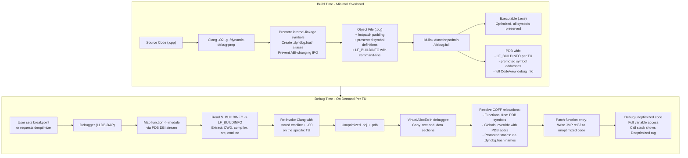
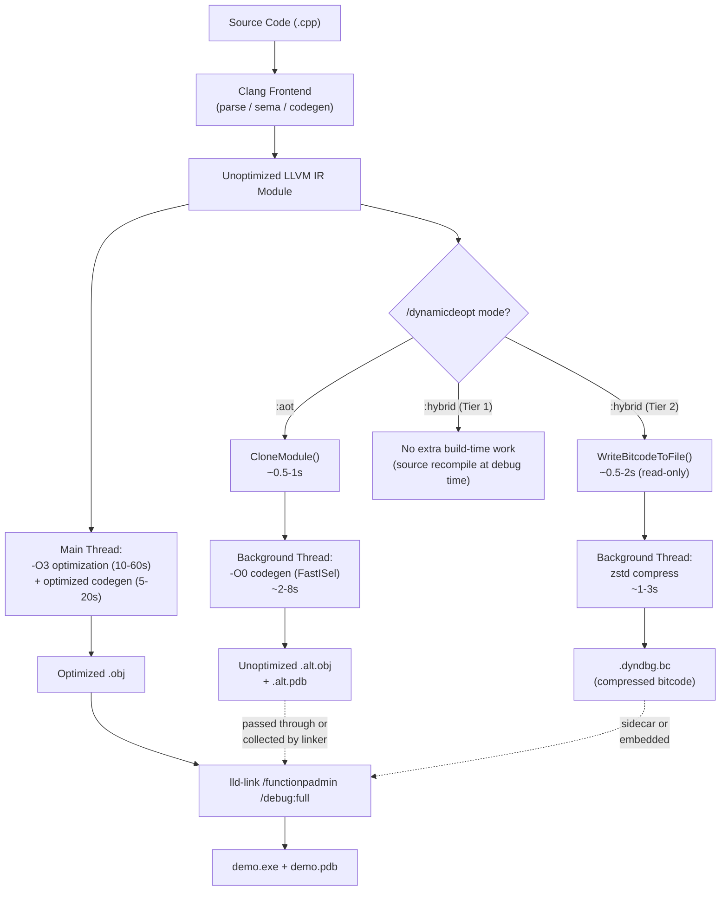

# Dynamic Debugging for Optimized C++ on COFF/CodeView: Analysis and Implementation Plan

## PoC branch status (LLVM tree)

This section records what the **experimental PoC branch** implements today versus this document. Strikethrough (**~~done~~**) marks items that are **substantially** landed in code; partial work is called out explicitly.

### `llvm-dyndbg --function` vs “only patch one function”

**Today:** `--function NAME` only adds `-mllvm -dynamic-debug-extern-keep=NAME` for the `-O0` replay compile. That **preserves full IR bodies** for **internal-linkage** functions whose mangled/IR name **contains** `NAME`. The translation unit is still compiled **in full**: every **external/COMDAT** function in the TU still emits a **complete** `-O0` definition into `*.dyndbg.obj`. So you do **not** get “strip all symbols except `DiagnoseUseOfDecl`.”

**Target (per this document):** To load and patch **only one** function in memory, you need **Tier 2–style per-function extraction** (see [Two Tiers of Implementation](#two-tiers-of-implementation)): lazy bitcode, materialize one function, `GlobalDCE`, codegen — or **Option C**-style compiler support to emit **only** selected definitions with everything else `extern`. Neither is wired to `--function` yet.

**Option B** (recommended Tier 1 in the doc) explicitly allows a **fat** `-O0` object and relies on the **debugger loader** binding symbols to PDB addresses; it does **not** require a single-function object.

### Implemented in PoC (high level)

| Area | What landed |
|------|-------------|
| Build-time | ~~`-fdynamic-debug-prep`~~, `DynamicDebugPrepPass` (`.dyndbg.<hash>` aliases + `@llvm.used`), ~~auto `-fms-hotpatch`~~ when `/dynamicdeopt*` (clang-cl); `MSVC.cpp` treats `/dynamicdeopt*` like hotpatch for `/functionpadmin` |
| Recompile-time | ~~`-fdynamic-debug-extern`~~, `DynamicDebugExternPass` (externalize locals; ~~GlobalAlias fix~~; PCH strip in tool for `-O0` replay) |
| Hybrid bitcode | ~~`-fdynamic-debug-bitcode`~~ embeds **zstd**-compressed pre-opt IR in COFF **`.dyndbg`** (header `DYDB` + size + flag); ~~sidecar~~ `-fdynamic-debug-bitcode-sidecar` |
| Driver | ~~`/dynamicdeopt`~~ = hybrid; ~~`:dynamic`~~ (prep only); ~~`:aot`~~ warns; help lists modes |
| Tooling | ~~`llvm-dyndbg`~~: PDB `LF_BUILDINFO`, `--gen-recompile`, `--execute`, `--module`, `--function`, hash from publics, ~~`--extract-bc`~~ |
| Demo | ~~`demo/dynamic-debugging/`~~ CMake + sources (math_utils / static / inline) |

### Not implemented (still per this doc)

LLDB/DAP plugin, in-process load + COFF relocate + `jmp` patch, step-into interception, thread-safe patching, `preserve-abi` IPO guards, `__ref_*` globals path, AOT `.alt.obj` / lld dual-link, per-function bitcode extract in the debugger, `/dynamicdeopt-storage:*`, parallel PCH-safe single-function compile flags.

---

## Problem Statement

Debugging optimized C++ builds is painful: variables get optimized away, stepping is unpredictable, and breakpoints in inlined functions don't fire. The goal is to provide a way to debug specific functions as if they were compiled at `-O0`, while the rest of the program runs optimized -- on Windows (COFF/CodeView/PDB).

---

## Comparison of All Known Approaches

### Approach A: MSVC `/dynamicdeopt` (Ahead-of-time dual binary)

**Mechanism**: The compiler generates two complete builds simultaneously -- an optimized `.exe` and an unoptimized `.alt.exe` (with `.alt.pdb`). The same macros/defines are used for both. The debugger patches function entries at runtime to redirect to the unoptimized version.

**Trade-offs:**

- Build output size: **+2.4x** (Lyra sample)
- End-to-end build time: **+1.05x to +1.15x**
- Iteration build time: **up to +1.8x** for large monolithic binaries
- Incompatible with `/GL` (whole program optimization), PGO, `/OPT:ICF`, Edit-and-Continue
- x64 only
- Zero latency at debug time -- everything is pre-built

**Key insight**: The "brute-force" approach pays a massive upfront tax even though >95% of code won't be debugged in a given session. As the Live++ developer (MolecularMatters) stated on the RFC: "It's essentially wasting a ton of resources on things you aren't going to need anyway."

---

### Approach B: LLVM RFC by OCHyams/Ng (Nested ELF)

**Mechanism**: Same concept as MSVC (dual compilation), but embeds the unoptimized binary inside the optimized one in a `.debug_llvm_dyndbg` section. The inner ELF remains relocatable (ET_REL); the debugger extracts it, applies relocations, and loads `.text` into the debuggee memory.

**Trade-offs:**

- Executable size: **+189%** (geomean over CTMark)
- Compile time: **+14.81%** (geomean), range from +2% to +40% depending on codebase
- Debug section bloat: `.debug_info` alone grows +50% (+321 MB on a large codebase)
- ELF only (no COFF/CodeView support)
- Prevents some IPO (function specialization, GlobalOpt alias replacement)
- Single file output (easier for build systems than MSVC's two-binary approach)

**Key insight**: Same fundamental trade-off as MSVC -- massive upfront cost for instant debug-time response. Caroline Tice (Google) noted on the RFC: nearly doubling binary size is "a non-starter for many larger projects already struggling with a 1x binary size."

---

### Approach C: Live++ Hot-Deoptimize (On-demand recompilation)

**Mechanism**: Uses PDB info to understand project structure (TUs, headers, compiler flags). On demand, recompiles specific translation units with `-O0`, creates a patch module, and injects it into the running process via binary patching. Requires `/FUNCTIONPADMIN` for patch space.

**Trade-offs:**

- **Zero upfront tax**: No build time or size increase
- Per-TU granularity -- only pay for what you debug
- Can re-optimize when done debugging
- Works with any debugger
- Requires compiler and source code at debug time
- Some latency when first deoptimizing a TU (seconds for recompilation)
- Commercial/proprietary product
- Fights over function patching with other tools

**Key insight**: The most practical approach today. Proves that on-demand recompilation is viable and works at scale (UE5/Fortnite-class projects).

---

### Approach D: Improved Debug Info Emission

**Mechanism**: Fix the compiler to emit more accurate DWARF/CodeView at all optimization levels. John Byrd's position on the RFC: "The compiler knows, at all times, exactly where variables are stored [...] it simply needs to emit correct DWARF at EVERY optimization level."

**Trade-offs:**

- Zero overhead
- Fundamentally limited: as Adrian Prantl (Apple) pointed out, there are many situations where the compiler **cannot** accurately preserve debug info (merged instructions, ambiguous locations, vectorized loops, etc.)
- Would improve the baseline experience but cannot match an unoptimized debug experience
- Incremental progress is already happening: LLVM's "Key Instructions" feature (`-gkey-instructions`) reduces stepping jumpiness

**Key insight**: Complementary, not a replacement. Worth pursuing in parallel but cannot solve the full problem.

---

### Approach E: Hybrid On-Demand (Recommended for COFF/CodeView)

This is the approach that best addresses the user's requirements. It combines minimal build-time preparation with on-demand compilation at debug time.

**Mechanism:**

- **Build time**: Compile normally with `-O2 -g` plus a lightweight flag (`-fdynamic-debug-prep`) that: (1) ensures hotpatch padding on all functions, (2) preserves symbol definitions and prevents ABI-changing IPO, and (3) promotes internal-linkage functions to externally-reachable symbols.
- **Debug time**: When a breakpoint is set or the user requests deoptimization of a function, the debugger: (1) identifies the TU from PDB, (2) retrieves the compiler command-line from `LF_BUILDINFO`, (3) invokes the compiler with `-O0`, (4) loads the resulting code into the process and resolves relocations against the PDB symbol table, (5) patches the function entry.

---

## Detailed Architecture for Approach E on COFF/CodeView

### Existing LLVM Infrastructure to Leverage

**Command-line is already stored in PDB** -- No new work needed for this. The `LF_BUILDINFO` record (emitted by [llvm/lib/CodeGen/AsmPrinter/CodeViewDebug.cpp](llvm/lib/CodeGen/AsmPrinter/CodeViewDebug.cpp), `emitBuildInfo()`) already stores five fields per TU:

```
BuildInfoRecord::CurrentDirectory  -- Absolute CWD path
BuildInfoRecord::BuildTool         -- Absolute compiler path (Argv0)
BuildInfoRecord::SourceFile        -- Path to main source file
BuildInfoRecord::TypeServerPDB     -- Path to type server PDB
BuildInfoRecord::CommandLine       -- Full canonical -cc1 command line
```

This is populated from `MCTargetOptions::Argv0` and `MCTargetOptions::CommandlineArgs`, which is set by `flattenClangCommandLine()` in [clang/lib/CodeGen/BackendUtil.cpp](clang/lib/CodeGen/BackendUtil.cpp) (line 325). It stores the full `-cc1` invocation minus output file and main filename.

**Hotpatch padding** -- Fully supported: Clang `/hotpatch` flag, lld-link `/functionpadmin` and `/hotpatchcompatible`, CodeView `S_COMPILE3` with HotPatch flag.

**Global variable indirection (`__ref_`*)** -- The `WindowsSecureHotPatching` pass in [llvm/lib/CodeGen/WindowsSecureHotPatching.cpp](llvm/lib/CodeGen/WindowsSecureHotPatching.cpp) already creates `__ref_`* pointer variables for redirecting global accesses from patched functions to the base image. This same mechanism (or a variant of it) can be reused for dynamic debugging.

**ORC JIT with COFF support** -- `COFFPlatform.cpp` exists but debugger support is not implemented for COFF yet.

**LLDB DAP** -- Full DAP server in `lldb/tools/lldb-dap/`.

---

### Build-Time Requirements: Symbol Preservation and ABI Stability

This is the critical build-time work. The `-fdynamic-debug-prep` flag must ensure the optimized binary is "patchable" -- that unoptimized code compiled later can be injected and call into the optimized binary correctly.

#### Problem 1: Internal-linkage functions may vanish

When the optimizer inlines a `static` function or anonymous-namespace function into all its callers, it can delete the out-of-line definition entirely. If we later compile the TU at `-O0`, the unoptimized code will emit a `call` to that function -- but the address doesn't exist in the optimized binary.

**Solution** (same as the RFC): Promote internal-linkage functions to external linkage by creating aliases with a TU-unique suffix:

```
// Original:
static int helper(int x) { ... }   // internal linkage, may be deleted

// After -fdynamic-debug-prep:
int helper(int x) { ... }                            // kept alive
@helper.dyndbg.<TU-hash> = alias i32(i32), @helper   // external alias
```

The `<TU-hash>` suffix (hash of directory + filename + driver flags) ensures uniqueness across TUs that might both have a `static helper()`. The alias prevents the optimizer from deleting the definition (it has an external user) while still allowing inlining of the original function body into callers.

**Key files to modify:**

- [clang/lib/CodeGen/CodeGenModule.cpp](clang/lib/CodeGen/CodeGenModule.cpp): Create promotion aliases after codegen
- OR a new LLVM pass that runs before the optimization pipeline

#### Problem 2: ABI-changing IPO must be prevented

Several LLVM passes can change function signatures or calling conventions:

- **Function Specialization** ([llvm/lib/Transforms/IPO/FunctionSpecialization.cpp](llvm/lib/Transforms/IPO/FunctionSpecialization.cpp)): Creates clones with specialized parameter values. The unoptimized code would call the original signature but the optimized binary uses the specialized version.
- **Dead Argument Elimination** ([llvm/lib/Transforms/IPO/DeadArgumentElimination.cpp](llvm/lib/Transforms/IPO/DeadArgumentElimination.cpp)): Removes unused parameters from internal functions.
- **Argument Promotion** ([llvm/lib/Transforms/IPO/ArgumentPromotion.cpp](llvm/lib/Transforms/IPO/ArgumentPromotion.cpp)): Changes pointer parameters to pass-by-value.
- **GlobalOpt** ([llvm/lib/Transforms/IPO/GlobalOpt.cpp](llvm/lib/Transforms/IPO/GlobalOpt.cpp)): Can replace aliases with aliasees, defeating the promotion scheme.

**Solution**: Add a function attribute (e.g., `"preserve-abi"`) that is checked by these passes. When the attribute is present, these passes skip the function. The external aliases created in Problem 1 already serve as a barrier to *most* IPO (the optimizer can't change the signature of a function that has an external alias), but we still need explicit guards for GlobalOpt alias replacement and function specialization of internal functions.

#### Problem 3: Hotpatch padding on all functions

Already solved: `-fms-hotpatch` / `/hotpatch` adds a 2-byte `mov edi, edi` (x86) or equivalent NOP prologue. Combined with `/functionpadmin:6` (x64), this provides enough space for a 5-byte `jmp rel32` instruction to redirect to the unoptimized version. The `-fdynamic-debug-prep` flag should automatically enable both.

#### Problem 4: Functions must meet minimum size

On x86_64, we need at least 5 bytes at each function entry to write a `jmp rel32`. Very small functions (single-instruction bodies) may not have enough space even with the hotpatch prologue. The RFC proposes a `tail-pad-to-size=<N>` attribute; for COFF, `/functionpadmin` already handles this by reserving 6 bytes before the function entry on x64. This should be sufficient.

---

### Debug-Time: Two Distinct Mechanisms

The RFC clearly describes two separate mechanisms that work together. All approaches (MSVC, the RFC, Live++, and our proposed Approach E) share these same two mechanisms, they just implement them differently.

#### Mechanism 1: Static Cross-References (unoptimized code calls optimized code)

The unoptimized code is compiled/loaded such that all its references -- function calls AND global variable accesses -- resolve to the optimized binary's symbols. When unoptimized `foo()` calls `bar()`, it calls the **optimized** `bar()` directly. When unoptimized code reads `g_counter`, it reads the **optimized binary's** `g_counter`.

This is how the program remains mostly optimized: the unoptimized code only exists for the specific functions being debugged; everything else runs at full speed. As the RFC states: "all of its globals reference the optimized binary (both data and code - so unoptimized functions call optimized ones). [...] Because unoptimized functions call optimized versions, continuing execution returns execution to the optimized binary."

How each approach implements this:

- **MSVC / RFC (ahead-of-time)**: The unoptimized binary is compiled at build time with all globals as extern declarations pointing to the optimized binary. Relocations are resolved by the linker (MSVC) or debugger (RFC).
- **Live++**: Recompiles TU on demand, patches relocations at load time against the running process.
- **Approach E (our on-demand)**: Recompiles TU on demand, resolves COFF relocations in the loaded `.obj` against PDB symbol addresses.

#### Mechanism 2: Runtime Step-Into Interception (debugger swaps optimized callee for unoptimized)

Since unoptimized code calls optimized functions by default (Mechanism 1), a second mechanism is needed when the user steps INTO a function call from unoptimized code. Without this, "Step Into" from unoptimized `foo()` calling `bar()` would land in the optimized `bar()` -- defeating the purpose.

The RFC describes this explicitly:

> "Function calls in the unoptimised code will call functions in the optimised code. The Debugger must force execution back to the unoptimised code when stepping into function calls from unoptimized code. The Debugger should:
>
> - Put a temporary breakpoint on the call target.
> - After stopping at the call target, map the PC to the corresponding function in the unoptimised code.
> - Set the PC to the start of the function in the unoptimised code."

In the ahead-of-time approaches (MSVC, RFC), the unoptimized callee always exists (it was pre-built). In our on-demand approach, there is an additional choice: the debugger can either (a) compile the callee's TU on-the-fly when the user steps into it, or (b) fall through to the optimized version if the user doesn't want to wait.

This runtime mechanism is the ONLY cross-reference mechanism needed for Approach E. Since we resolve all relocations against the PDB at load time (Mechanism 1), the unoptimized code naturally calls optimized functions. The debugger intercepts step-into to swap to unoptimized versions. This works as long as all optimized symbols and globals are reachable in the PDB (not stripped).

---

### Debug-Time: On-Demand Recompilation and Code Injection

#### Step 1: Identify TU and retrieve command-line from PDB

When the user sets a breakpoint or requests deoptimization:

1. Map the function to its contributing module (compiland) using the PDB's DBI stream module info
2. From the module's symbol stream, read `S_BUILDINFO` which points to `LF_BUILDINFO` in the IPI stream
3. Extract the five fields: CWD, compiler path, source file, type server PDB, and command-line

This is already implemented in LLDB's NativePDB plugin: [lldb/source/Plugins/SymbolFile/NativePDB/CompileUnitIndex.cpp](lldb/source/Plugins/SymbolFile/NativePDB/CompileUnitIndex.cpp) (`ParseBuildInfo`).

#### Step 2: Obtain source and re-invoke Clang at -O0

The source file path is stored in `LF_BUILDINFO::SourceFile`. It can be obtained from multiple sources:

- **Local filesystem**: The most common case during development -- source is already on disk.
- **Source server / source indexing**: PDBs support `srcsrv` streams that encode how to fetch source from version control (Perforce, Git, etc.). The debugger can fetch the exact revision.
- **Embedded source**: PDB can embed source files directly (via `/embed` flag or Clang's `-g -gsrc-embed`), making the PDB self-contained.

Take the stored `-cc1` command-line, modify it:

- Replace optimization flags (`-O2`, `-O3`, etc.) with `-O0`
- Remove `-fdynamic-debug-prep` (not needed for the deoptimized build)
- Add the source file path and output to a temp `.obj`
- Invoke the compiler (path from `LF_BUILDINFO::BuildTool`)

The CWD from `LF_BUILDINFO::CurrentDirectory` ensures include paths resolve correctly. The command-line from `LF_BUILDINFO::CommandLine` preserves all defines, language mode, target, etc.

**Correctness constraint**: The source files must match what was compiled. This is the same constraint as any source-level debugging -- if the source has changed since the build, line numbers and variable names won't match. Source server / embedded source guarantees this.

#### Step 3: Load unoptimized code into the process

The recompiled `-O0` `.obj` file contains:

- `.text` sections with unoptimized function bodies
- COFF relocations against external symbols (function calls, global accesses)
- `.debug$S` / `.debug$T` sections with CodeView debug info
- Data sections (`.data`, `.rdata`, `.bss`) with TU-local globals

**Loading the code:**

1. `VirtualAllocEx` in the debuggee process to allocate memory for `.text` (executable) and `.data` (read-write)
2. Copy the section data into the allocated memory
3. Apply COFF relocations by resolving symbols against the PDB (Mechanism 1)

#### Step 4: Resolve symbols -- three options for static cross-references

The unoptimized `.obj` has relocations against functions and globals. These must resolve to the optimized binary's addresses so that Mechanism 1 works correctly. There are three options for how to achieve this:

*Option A -- `__ref`_ indirection (leveraging WindowsSecureHotPatching)**:

- Apply the `WindowsSecureHotPatching`-style `__ref`_* transformation during the `-O0` recompilation
- Each global access goes through a `__ref`_* pointer that the debugger sets to point to the optimized binary's global
- Function calls: still resolved directly against PDB symbols via relocations
- Pro: Explicit separation -- clear which globals are "theirs" vs "ours"; reuses existing pass
- Con: Adds indirection overhead on every global access in unoptimized code; requires per-global setup in debuggee

**Option B -- Relocation override at load time (recommended)**:

- Compile the TU normally at `-O0` (it will define its own copies of TU-local globals)
- When the debugger loads the `.obj` and applies COFF relocations, it overrides symbol addresses:
  - For every symbol (function or global) that also exists in the PDB, use the PDB's address
  - The `.obj`'s own data section definitions for globals are discarded; the optimized binary's globals are used instead
  - For promoted internal-linkage symbols (`.dyndbg.<hash>` names): resolve via the PDB using the promoted name
- This is the simplest approach and requires no compiler-side changes for the on-demand compilation step
- The ONLY mechanism is the runtime one (Mechanism 2): the debugger intercepts step-into to redirect to unoptimized callees
- Pro: No indirection overhead; no special compilation flags for the -O0 build; works as long as all symbols are reachable in PDB
- Con: The loader must know to prefer PDB addresses over `.obj` definitions; TU-local globals require the promoted names to exist in PDB

**Option C -- Compile with externs only**:

- When re-invoking Clang at `-O0`, pass a special flag that suppresses global definitions and emits them as `extern` declarations instead
- Only function bodies are emitted as definitions; all globals and other-TU functions are extern
- Pro: Cleanest `.obj` output -- no duplicate definitions to resolve
- Con: Requires new Clang frontend work; suppressing definitions of globals declared in source is non-trivial (constructors, initializers, static locals all complicate this)

**Recommendation**: Option B for Tier 1. It requires zero compiler changes for the on-demand recompilation step -- all the intelligence is in the debugger's `.obj` loader. The requirement is that all symbols (including promoted internal ones) are present in the PDB and not stripped. The `-fdynamic-debug-prep` build-time flag already ensures this via symbol promotion and hotpatch padding.

#### Step 5: Patch function entries

Write a `jmp rel32` (5 bytes) at the start of each optimized function that has been deoptimized, redirecting to the unoptimized version loaded in Step 3. The hotpatch padding provides the space for this.

- Reference-count patches: multiple breakpoints in the same function share one patch
- Thread safety: check that no thread's instruction pointer is inside the function being patched before writing the `jmp`; use a fallback (temporary breakpoint at function entry + PC redirect) if unsafe
- On detach or reoptimize: restore the original bytes

#### Step 6: Runtime step-into interception (Mechanism 2)

When the user does "Step Into" from unoptimized code:

1. The debugger identifies the call target address (which is the optimized callee, per Mechanism 1)
2. It sets a temporary breakpoint at the optimized callee's entry
3. When the temp breakpoint hits, the debugger checks: has this callee's TU been deoptimized?
  - **If yes**: Map the PC to the corresponding unoptimized function and set PC there
  - **If no**: Two choices:
    - **(a) On-demand deopt**: Trigger recompilation of the callee's TU, load it, then redirect. This adds latency but gives full debuggability.
    - **(b) Fall through**: Let execution continue in the optimized callee. The user stays in optimized code until they return to the unoptimized caller. No latency.
  - The debugger can offer this as a user preference or prompt
4. If the user does "Step Over" instead, no interception is needed -- the optimized callee runs at full speed and returns to unoptimized code normally

---

### Data Flow Diagram




---

### Two Tiers of Implementation

**Tier 1 -- Source-based on-demand** (simplest):

- Build-time: hotpatch padding, symbol promotion, ABI-preserving IPO constraints
- Debug-time: read `LF_BUILDINFO` from PDB, obtain source (local / source server / PDB-embedded), re-invoke compiler at `-O0`, load `.obj`, resolve relocations against PDB, patch entries
- Source is needed at debug time, but the user may not need to have it locally beforehand: source servers (`srcsrv` PDB streams), PDB-embedded source, or network-accessible source roots all work. The LF_BUILDINFO command-line and CWD ensure the recompilation reproduces the same result.
- Compiler must be available on the debug machine (typical for local development)

**Tier 2 -- Bitcode-based on-demand with per-function extraction** (eliminates source/compiler dependency, much faster):

At build time, embed pre-optimization LLVM bitcode in `.llvmbc` COFF section (infrastructure already exists via `-fembed-bitcode`; lld-link strips `.llvmbc` by default but can be told to preserve it). At debug time, extract and codegen ONLY the requested function, not the entire TU.

**Why per-function extraction matters (especially for unity builds):**

Unreal Engine and other large projects use unity/amalgamated builds where 10-50 `.cpp` files are combined into a single TU. The resulting bitcode for a single unity TU can be massive (hundreds of MB), containing thousands of function definitions and enormous type metadata. Codegen'ing the whole TU at `-O0` at debug time would defeat the purpose -- it could take 20-80+ seconds for a large unity TU.

Per-function extraction avoids this entirely. LLVM already has all the infrastructure:

- **Lazy bitcode loading** ([llvm/include/llvm/Bitcode/BitcodeReader.h](llvm/include/llvm/Bitcode/BitcodeReader.h)): `getLazyBitcodeModule()` reads only the module index/structure without deserializing any function bodies. With `ShouldLazyLoadMetadata=true`, even metadata blocks are deferred.
- **Selective materialization**: `Function::materialize()` deserializes only the requested function's body from the bitcode stream. All other functions remain as lazy stubs.
- `**ExtractGVPass`** ([llvm/include/llvm/Transforms/IPO/ExtractGV.h](llvm/include/llvm/Transforms/IPO/ExtractGV.h)): Keeps only specified global values; turns everything else into extern declarations.
- `**llvm-extract` tool** ([llvm/tools/llvm-extract/llvm-extract.cpp](llvm/tools/llvm-extract/llvm-extract.cpp)): Already implements the full pipeline: lazy load, materialize selected functions, extract, GlobalDCE, StripDeadDebugInfo, emit.

The per-function pipeline at debug time would be:

```
getLazyBitcodeModule(buffer, ctx, ShouldLazyLoadMetadata=true)
  -> F = M->getFunction("_Z3fooi")    // lookup by mangled name
  -> F->materialize()                  // deserialize only this function's body
  -> ExtractGVPass({F})                // keep F, turn everything else into decls
  -> GlobalDCEPass()                   // remove unreachable declarations
  -> StripDeadDebugInfoPass()          // keep only debug info referenced by F
  -> -O0 codegen (FastISel + trivial RegAlloc + AsmPrinter)
  -> emit .obj
```

We do NOT need recursive function extraction (walking callees) because all function calls in the extracted code resolve to the optimized binary via relocations (Mechanism 1). Only the target function needs a definition; everything else it calls becomes an extern declaration resolved against the PDB.

**Estimated cost comparison for a unity TU with ~2000 functions:**

- Whole-TU codegen from bitcode: ~20-80s (dominated by materializing + codegen'ing all 2000 functions)
- Per-function extraction: ~1-3s (dominated by initial bitcode index + metadata load; the actual function codegen is <50ms)
- Per-function with cached Module: <100ms (if the lazy Module is kept in memory across extractions from the same TU)

**Caching strategy**: The debugger should cache the lazy-loaded `Module` per TU. The first deoptimization from a TU pays the ~1-3s index load cost. Subsequent functions from the same TU (common when stepping through code in one file within a unity build) materialize + codegen in milliseconds.

**Additional properties of Tier 2:**

- **No source files needed**: the bitcode is self-contained and guaranteed to match the optimized binary (generated from the same compilation)
- **No compiler executable needed**: the debugger embeds just the LLVM code generator (much smaller than full Clang)
- **No parsing/sema/IR-gen**: Going from LLVM bitcode to machine code skips C++parsing, semantic analysis, template instantiation, and IR generation -- the most expensive parts of compiling template-heavy C++
- **Tradeoff -- storage**: the `.llvmbc` section adds to build output size (proportional to bitcode size per TU, reduced by zstd compression ~3-5x). This is more compact than pre-compiled unoptimized machine code (what MSVC/RFC store). Can be stripped for shipping builds.

**Build-time strategy: parallel serialization + compression**

The bitcode must be captured BEFORE the -O3 optimization pipeline (since optimization mutates the Module in place). The recommended approach serializes the bitcode synchronously (fast) and compresses in a background thread:

1. After frontend CodeGen, before `RunOptimizationPipeline()`: call `WriteBitcodeToFile(M, buffer)` to serialize the unoptimized IR to a `SmallVector<char>`. This takes `const Module &` -- read-only, no conflict with anything. Cost: ~0.5-2s for large unity TUs.
2. Spawn a background thread (using LLVM's `StdThreadPool` / `std::async`) that compresses the buffer with `llvm::compression::zstd::compress()`. Cost: ~1-3s, runs fully in parallel with -O3.
3. The main thread proceeds with `-O3` optimization (10-60s) and backend codegen (5-20s).
4. Before the AsmPrinter writes the final `.obj`, wait for the background compression to complete and embed the compressed buffer as a `.llvmbc` section.

Since -O3 optimization dominates the timeline, the compression always finishes long before it's needed. The only critical-path addition is the bitcode serialization (~0.5-2s).

```
Time:  0       1s         2s                    30s                 60s
       |--------|----------|---------------------|--------------------
Main:  [Serialize] [------- -O3 optimization --------] [-- Codegen --] [Emit .obj+.llvmbc]
BG:              [-- zstd compress --]                                       ^
                                     ^done ~3s                    embed compressed buffer
```

The hook point is [clang/lib/CodeGen/CodeGenAction.cpp](clang/lib/CodeGen/CodeGenAction.cpp) line 310, where `EmbedBitcode()` is already called before `emitBackendOutput()`. The infrastructure for embedding bitcode in COFF `.llvmbc` sections already exists (`embedBitcodeInModule()` in [llvm/lib/Bitcode/Writer/BitcodeWriter.cpp](llvm/lib/Bitcode/Writer/BitcodeWriter.cpp)).

For reference, MSVC's `/dynamicdeopt` spawns a **full parallel code generator** for the unoptimized build (which is far more expensive). Their `/dynamicdeopt:sync` flag exists to serialize this. Our approach is a fraction of that cost.

**Alternative considered -- CloneModule + fully parallel serialize**: Clone the Module (~0.5-1s), then serialize+compress the clone in the background while the main thread optimizes the original. This moves serialization off the critical path but adds the clone cost instead (roughly equal), temporarily doubles memory usage, and adds complexity. Not recommended; the simpler "serialize then fork compression" approach has the same net critical-path impact.

**No link step needed for unoptimized bitcode:**

Unlike ThinLTO (which has a "thin link" step to read module summaries and decide cross-module imports), our unoptimized bitcode requires no link step. Each TU's bitcode is self-contained for per-function extraction. All cross-TU references resolve against the PDB at debug time. The PDB IS the link -- it maps every symbol to its final address in the optimized binary.

**No additional index or manifest needed:**

The PDB already provides the function-to-bitcode mapping:

```
function (by address/name)
  → PDB module/compiland (DBI stream, DbiModuleDescriptor)
    → ObjFileName (DbiModuleDescriptor::getObjFileName())
      → derive .bc path: "foo.obj" → "foo.dyndbg.bc"
    → S_BUILDINFO → LF_BUILDINFO (CWD, compiler, source, cmdline)
```

No remarks are needed (remarks describe optimizer decisions, not useful at debug time).

The only supplemental metadata is a small table of promoted symbol names (internal-linkage functions that got `.dyndbg.<hash>` aliases), so the debugger can map between unoptimized code's symbol names and the promoted names in the PDB. This table can be embedded in the `.bc` file header.

**Bitcode storage options:**

- **Separate `.bc` files** (simplest, good for testing/dev): Clang writes `foo.obj` and `foo.dyndbg.bc` side by side. Add a `-fdynamic-debug-prep-bc=<path>` flag to control the output path. The PDB's `ObjFileName` per module derives the `.bc` path via naming convention. No linker changes needed.
- **Linker-collected archive** (cleanest for distribution): lld-link reads `.llvmbc` sections from input `.obj` files and writes a single `.dyndbg.bca` (bitcode archive) with a per-module index. The PDB records the archive path. Needs linker work but produces a single artifact.
- **Embedded in `.exe`** (self-contained): Preserve `.llvmbc` sections through linking (currently stripped by lld-link at [lld/COFF/InputFiles.cpp](lld/COFF/InputFiles.cpp) line 409). Increases `.exe` size but keeps everything in one file.

Recommendation: Start with separate `.bc` files for development and testing. Add the linker-collected archive later for production workflows.

- **Possible further optimization**: At build time, split the bitcode per logical source file within a unity TU (using `DICompileUnit` boundaries). This reduces the per-TU bitcode size and makes the initial lazy load faster at debug time. However this adds complexity and may not be needed if Module caching is effective.

---

### AOT Mode: Ahead-of-Time Unoptimized Code Generation (`/dynamicdeopt:aot`)

The hybrid on-demand approach (Tiers 1 and 2) optimizes for minimal build-time cost at the expense of some debug-time latency. The AOT mode instead pre-generates unoptimized machine code at build time -- the same fundamental strategy as MSVC's `/dynamicdeopt` and the Sony RFC's nested ELF -- but implemented within the same unified framework, sharing all build-time preparation and debug-time infrastructure.

#### Unified Pipeline: The Fork Point

All three modes (AOT, hybrid Tier 1, hybrid Tier 2) share the same pipeline up to a single fork point: **after frontend CodeGen produces unoptimized LLVM IR, before the optimization pipeline runs.** At this point, the unoptimized Module is available and the mode-specific work diverges:




The critical insight is that **-O3 optimization dominates the timeline** (10-60s for large TUs). Both the AOT background codegen (~~2-8s) and the hybrid bitcode serialization+compression (~~1-3s) complete long before the main thread finishes -O3. The only critical-path addition in either mode is the initial fork operation:

- **AOT**: `CloneModule()` -- ~0.5-1s. Clones the unoptimized IR so the main thread can mutate the original during -O3. The clone is handed to a background thread for -O0 codegen.
- **Hybrid Tier 2**: `WriteBitcodeToFile()` -- ~0.5-2s. Read-only operation on the Module; no clone needed. Compression runs in background.
- **Hybrid Tier 1**: Zero. Nothing happens at build time beyond the shared preparation.

```
Time:  0        1s          2s                     30s                  60s
       |---------|-----------|----------------------|---------------------
Main:  [Clone/Ser] [------------ -O3 optimization -----------] [Codegen] [Emit .obj]
BG:              [-- -O0 codegen (AOT) --]   ^done ~8s
       OR:       [-- zstd compress (T2) --]  ^done ~3s
```

This is strictly more efficient than MSVC's approach, which runs the **entire** compilation twice (including C++parsing, semantic analysis, template instantiation, and IR generation). For template-heavy C++ game engine code, the frontend is often 30-50% of total compilation time -- all of which is avoided by forking at the IR level.

#### AOT: Background -O0 Codegen Details

The background thread receives the cloned Module and runs a minimal -O0 pipeline:

1. **No optimization passes**: Skip the entire `PassBuilder` optimization pipeline.
2. **FastISel** for instruction selection (fast, generates straightforward code).
3. **Trivial register allocator** (no live range analysis needed at -O0).
4. **AsmPrinter** to emit the `.alt.obj` with full CodeView debug info.
5. The background thread writes to a temporary buffer or file. The main thread collects the result before final `.obj` emission (if embedding) or the background thread writes `.alt.obj` directly to disk.

The cloned Module retains all debug metadata (`DISubprogram`, `DILocalVariable`, etc.) from the frontend. Since no optimization runs, debug info is trivially accurate -- every source variable has a stack slot, every source line has a corresponding instruction, no inlining has occurred.

**Memory overhead**: `CloneModule` temporarily doubles the IR memory usage. For large unity TUs this can be significant (hundreds of MB). The clone is freed as soon as -O0 codegen completes. If memory is a concern, a flag `/dynamicdeopt:aot:lowmem` could serialize the Module to bitcode first (like Tier 2), then re-read it in the background thread, trading CPU for memory.

#### AOT Storage: Three Options

**Option 1 -- Separate `.alt.obj` / `.alt.pdb` files (default, MSVC-compatible):**

This matches MSVC's output model. For each TU, Clang produces both `foo.obj` (optimized) and `foo.alt.obj` (unoptimized, -O0). The linker produces both `demo.exe` + `demo.pdb` (optimized) and `demo.alt.exe` + `demo.alt.pdb` (unoptimized).

```bash
# Build:
clang-cl /O2 /Z7 /dynamicdeopt:aot -c math_utils.cpp
# Produces: math_utils.obj + math_utils.alt.obj

lld-link /debug:full /functionpadmin /dynamicdeopt \
    main.obj math_utils.obj /out:demo.exe
# Produces: demo.exe + demo.pdb + demo.alt.exe + demo.alt.pdb
```

This is the recommended default because:

- Visual Studio's debugger already knows how to consume `.alt.exe` / `.alt.pdb` files from MSVC's `/dynamicdeopt`. Using the same naming convention means **VS can debug Clang-built AOT binaries with zero debugger changes**.
- Build systems that already handle MSVC's `/dynamicdeopt` output will work unchanged.
- The `.alt.pdb` contains full unoptimized CodeView debug info, usable by any PDB-aware debugger.

The linker's role in this mode:

- lld-link receives both `foo.obj` and `foo.alt.obj` files (the `.alt.obj` files can be passed via a response file, or lld-link can discover them via naming convention when `/dynamicdeopt` is specified)
- It performs two link operations: one for the optimized binary and one for the unoptimized binary
- The unoptimized link resolves all function calls and global references to the **optimized** binary's addresses (same as the Sony RFC -- the unoptimized code calls optimized code)
- Alternatively, the debugger handles relocation at load time (as in the hybrid approach), and the `.alt.obj` files are simply collected into an archive without a full link step

**Option 2 -- Embedded COFF section (`/dynamicdeopt:aot /dynamicdeopt-storage:embed`):**

The unoptimized machine code is embedded in a `.dyndbg` COFF section in each `.obj` file. The linker collects these sections into a single `.dyndbg` section in the output executable, analogous to the Sony RFC's `.debug_llvm_dyndbg` ELF section.

```bash
clang-cl /O2 /Z7 /dynamicdeopt:aot /dynamicdeopt-storage:embed -c math_utils.cpp
# Produces: math_utils.obj (contains .dyndbg section with unoptimized code)

lld-link /debug:full /functionpadmin main.obj math_utils.obj /out:demo.exe
# Produces: demo.exe (single file, .dyndbg section contains unoptimized code)
```

Pros:

- Single `.obj` per TU, single `.exe` output -- build systems manage fewer files.
- The embedded code remains relocatable (COFF relocations preserved); the debugger applies them at load time against PDB symbols, just like the hybrid approach.
- Can be stripped for shipping builds (`/STRIP:.dyndbg` or a post-link tool).

Cons:

- Not compatible with Visual Studio's existing `/dynamicdeopt` debugger support (VS expects separate `.alt.exe`).
- Larger `.obj` and `.exe` files during development.
- Requires LLDB-side work to extract and load the embedded section.

**Option 3 -- Linker-collected archive (`/dynamicdeopt:aot /dynamicdeopt-storage:archive`):**

lld-link reads `.dyndbg` sections from input `.obj` files (or reads `.alt.obj` files) and collects them into a single `.dyndbg.bca` sidecar archive alongside the PDB. The PDB records the archive path.

```bash
clang-cl /O2 /Z7 /dynamicdeopt:aot -c math_utils.cpp
# Produces: math_utils.obj + math_utils.alt.obj

lld-link /debug:full /functionpadmin /dynamicdeopt /dynamicdeopt-storage:archive \
    main.obj math_utils.obj /out:demo.exe
# Produces: demo.exe + demo.pdb + demo.dyndbg.bca
```

Pros:

- Single sidecar artifact for all unoptimized code, alongside the PDB.
- The archive includes a per-module index for fast lookup by the debugger.
- Clean separation: the `.exe` stays lean; unoptimized code is a separate artifact like the PDB.

Cons:

- Requires linker work to collect and index the archive.
- New artifact type that build systems / symbol servers / crash analysis tools need to learn about.
- Not compatible with Visual Studio's existing debugger support.

#### AOT: What the Debugger Does Differently

From the debugger's perspective, the AOT and hybrid modes are nearly identical. The only difference is the source of unoptimized machine code:


| Step                           | Hybrid (Tier 1)                   | Hybrid (Tier 2)                                          | AOT                                                                    |
| ------------------------------ | --------------------------------- | -------------------------------------------------------- | ---------------------------------------------------------------------- |
| **1. Identify TU**             | PDB → S_BUILDINFO → LF_BUILDINFO  | PDB → ObjFileName → .dyndbg.bc                           | PDB → ObjFileName → .alt.obj or .dyndbg section                        |
| **2. Obtain unoptimized code** | Re-invoke Clang at -O0 (seconds)  | Extract function from bitcode + FastISel (<100ms cached) | Load pre-built .alt.obj or extract from .dyndbg section (milliseconds) |
| **3. Load into process**       | VirtualAllocEx + copy .text/.data | Same                                                     | Same                                                                   |
| **4. Resolve relocations**     | Against PDB symbols (Option B)    | Same                                                     | Same (or pre-resolved if fully linked)                                 |
| **5. Patch function entry**    | jmp rel32 to unoptimized code     | Same                                                     | Same                                                                   |
| **6. Step-into interception**  | Mechanism 2 (identical)           | Same                                                     | Same                                                                   |


Steps 3-6 are **completely shared** across all modes. The debugger plugin needs mode-specific logic only for steps 1-2 (locating and loading the unoptimized code).

#### Why Support Both AOT and Hybrid?

Different teams and workflows have different constraints:

- **AOT** is best when: debug-time latency is unacceptable (e.g., console development where stopping at a breakpoint must be instant), the toolchain is not available on the debug machine (remote debugging, QA machines), or Visual Studio compatibility is required.
- **Hybrid Tier 1** is best when: build time and storage are constrained, the toolchain and source are available locally, and a few seconds of latency at first breakpoint is acceptable.
- **Hybrid Tier 2** is best when: build time must be minimal, per-function granularity matters (unity builds), and the ~1-3s first-function / <100ms cached latency is acceptable. No source or full toolchain needed.

A team might even use different modes for different parts of their project: AOT for core engine code they debug constantly, hybrid for middleware and third-party code they rarely step into.

---

## Pros and Cons Summary


| Criterion                      | MSVC /dynamicdeopt       | LLVM RFC (Nested ELF) | Live++ Hot-Deoptimize           | Unified AOT (`/dynamicdeopt:aot`)                                            | Unified Hybrid (`/dynamicdeopt:hybrid`)                               |
| ------------------------------ | ------------------------ | --------------------- | ------------------------------- | ---------------------------------------------------------------------------- | --------------------------------------------------------------------- |
| **Build time overhead**        | +5-15% (up to 1.8x iter) | +15% (up to +40%)     | None                            | CloneModule ~0.5-1s + BG -O0 codegen (hidden behind -O3; no double frontend) | ~0.5-2s/TU (bitcode serialize; zstd hides behind -O3)                 |
| **Build output size**          | +2.4x                    | +2.9x                 | None                            | +2-2.5x (similar to MSVC; .alt.obj + .alt.pdb or embedded .dyndbg section)   | + zstd-compressed bitcode/TU (smaller than unopt machine code)        |
| **Debug-time latency**         | None (pre-built)         | None (pre-built)      | Seconds (recompile from source) | None (pre-built)                                                             | Tier 1: seconds (source recompile); Tier 2: 1-3s first, <100ms cached |
| **Source needed at debug**     | No                       | No                    | Yes (local)                     | No                                                                           | Tier 1: Yes (local/server/PDB-embedded); Tier 2: No                   |
| **Compiler needed at debug**   | No                       | No                    | Yes                             | No                                                                           | Tier 1: Yes; Tier 2: No (embedded LLVM backend)                       |
| **COFF/CodeView support**      | Yes (MSVC only)          | No (ELF only)         | Yes (Windows)                   | Yes (COFF; default .alt.obj output is VS-compatible)                         | Yes (COFF)                                                            |
| **ELF/DWARF support**          | No                       | Yes (proposed)        | No                              | Possible (same pipeline fork; ELF nested or sidecar)                         | Possible                                                              |
| **Open source**                | No                       | Yes (proposed)        | No                              | Yes                                                                          | Yes                                                                   |
| **Granularity**                | Per-function             | Per-function          | Per-TU                          | Per-function                                                                 | Per-function (Tier 2) / Per-TU (Tier 1)                               |
| **Compatible with hot-reload** | Conflicts                | Conflicts             | N/A (is the tool)               | Conflicts (same as MSVC)                                                     | Designed to coexist                                                   |
| **LTO / WPO compatible**       | No (/GL blocked)         | Unclear               | Yes                             | Possible (fork before LTO; needs investigation)                              | Yes                                                                   |
| **VS debugger compatible**     | Yes                      | No                    | No                              | Yes (default .alt.obj/.alt.pdb output)                                       | No (requires LLDB or DAP-aware debugger)                              |
| **Double frontend cost**       | Yes                      | No (clones IR)        | Yes (recompile from source)     | No (forks at IR level)                                                       | Tier 1: Yes (at debug time); Tier 2: No                               |
| **Shared build-time prep**     | N/A                      | Partial               | N/A                             | Yes (same `-fdynamic-debug-prep` as hybrid)                                  | Yes                                                                   |


---

## RFC Cross-Check: Gaps Identified for COFF/CodeView

The following points from the [RFC](https://discourse.llvm.org/t/rfc-dynamic-debugging-for-c-step-through-unoptimized-code-in-optimized-builds/90113) and its discussion thread were not fully addressed in the plan above. This section fills those gaps.

### Gap 1: Version / Compatibility Metadata

The RFC proposes: "We think it would be useful to add version information, for example in a .note."

For COFF, we need a way for the debugger to verify that a `.dyndbg.bc` file matches the optimized binary. If the user rebuilds some TUs but not others, or if the `.bc` files are stale, the bitcode won't match the optimized code.

**Solution**: Embed a hash (e.g., content hash of the optimized `.obj` or a build UUID) in both the `.dyndbg.bc` file header and in a CodeView `S_ENVBLOCK` or custom symbol record in the PDB. The debugger checks for match before using the bitcode. If mismatched, it can warn the user or fall back to source-based recompilation (Tier 1).

### Gap 2: Inlined Function Breakpoints (COFF/CodeView specifics)

The RFC describes: "When setting a file/line breakpoint for an inlined function the Debugger should: Find the possible parent functions for the inlined function using the inliners map. Repeat the process for non-inlined functions for every possible parent function."

For DWARF this uses `DW_TAG_inlined_subroutine`. For COFF/CodeView, the equivalent is:

- `**S_INLINESITE`** records in the PDB's module symbol streams. Each `S_INLINESITE` encodes which function was inlined and into which parent, with binary annotations for line/offset mapping.
- The debugger builds an **inliners map**: for each inlinee function, the set of all parent (caller) functions that inline it.
- When the user sets a breakpoint on an inlined function (e.g., `clamp()` in the demo), the debugger must:
  1. Find all parents from the inliners map (e.g., `compute()`, `main()`, and any other callers)
  2. Deoptimize each parent function (extract from `.dyndbg.bc`, codegen, patch entry)
  3. Set the breakpoint in the unoptimized version of each parent, at the call site corresponding to the inlinee

This can be expensive for heavily-inlined functions (e.g., `std::move`, `operator<<`). The debugger should allow the user to scope the breakpoint to specific callers or files.

### Gap 3: COMDAT Handling

The RFC specifies: "globals with internal linkage **not in a COMDAT** are promoted."

On COFF, COMDATs are used extensively for:

- Inline functions (header-defined)
- Template instantiations
- Implicit instantiations of class methods

COMDAT functions already have external linkage and unique mangled names. They do NOT need promotion. The linker picks one definition and discards duplicates (via `IMAGE_COMDAT_SELECT_ANY` or similar). The key concern is:

- COMDAT functions must NOT be eliminated by the optimizer even if inlined everywhere. The `-fdynamic-debug-prep` flag must keep COMDAT function definitions alive (same treatment as non-COMDAT externals: the alias barrier prevents deletion).
- `/OPT:ICF` (Identical COMDAT Folding) must be disabled or restricted: ICF merges functions with identical bodies, which would cause the debugger to map one unoptimized function to a different optimized function's address. This is the same restriction MSVC imposes. The `/OPT:NOICF` flag or a more targeted approach (skip ICF for functions with the `preserve-abi` attribute) is needed.

### Gap 4: Thread-Safe Patching with Dual-Breakpoint Fallback

The RFC details a specific fallback mechanism that our plan only briefly mentions:

> "If the PC of any threads is currently in a function to be patched, it may not safe to apply. A fallback mechanism that uses temporary breakpoints and sets the PC in the Debugger when the breakpoint is hit can be used until the function is safe to patch. While using the fallback mechanism, the Debugger should also put a breakpoint in the **optimised** code. This is for the case where a thread may already be executing the function and will never end up in the unoptimised code."

For COFF/Windows, the full algorithm is:

1. Suspend all threads; check if any thread's RIP is inside the target function
2. **If no thread is inside**: Safe to patch. Write `JMP rel32` at the function entry. Resume.
3. **If a thread IS inside**: Do NOT patch yet. Instead:
  a. Set a temporary breakpoint at the **optimized** function's entry (for threads that enter later)
   b. Set a temporary breakpoint at the **unoptimized** function's entry (for the deoptimized path)
   c. When the optimized-entry breakpoint fires: redirect PC to the unoptimized version
   d. When all threads have exited the function (reference counting), apply the permanent `JMP` patch
4. Resume all threads.

This ensures correctness even in multi-threaded programs where one thread might be mid-execution in a function being patched.

### Gap 5: Attach/Detach Behavior

The RFC mentions: "When detaching, the Debugger should remove any patches it has added to optimised code. Debuggers can decide whether to remove the unoptimised code from the debuggee's memory when detaching."

For COFF/Windows:

- **On detach**: Restore all patched function entries to their original bytes. The program continues running fully optimized.
- **Optionally leave loaded code**: The unoptimized code and a small metadata block can be left in the debuggee's memory. If the debugger re-attaches, it can detect this metadata (e.g., at a well-known location or via a named section) and skip the initial bitcode load + codegen, resuming deoptimization instantly.
- **On process exit**: All allocated memory is cleaned up by the OS. No leak concern.
- **Crash dumps**: If the process crashes while deoptimized functions are active, the crash dump will contain the `JMP` patches. The dump analysis tool (e.g., WinDbg, LLDB) needs to be aware of this to correctly symbolicate the call stack. The metadata left by the debugger (mapping patched addresses to unoptimized function names) helps here.

### Gap 6: Macro/NDEBUG Consistency

The RFC discussion (Vlad Serebrennikov, post #2) raised concern about users expecting the unoptimized version to behave like a debug build (different `NDEBUG`, different assertions).

For our Tier 2 (bitcode) approach, this is a non-issue: the bitcode is captured from the SAME compilation with the SAME preprocessor state. `NDEBUG` is whatever the user set for the optimized build. There is no second parse. The unoptimized code will have the same `assert()` behavior, same `#ifdef` branches, same everything -- only the optimization level changes (from -O2/-O3 to -O0 at the codegen stage, not the frontend stage).

MSVC documents this explicitly: "The compiler flags that are used for the deoptimized version are the same as the flags that are used for the optimized version, except for optimization flags." Our approach inherits this property automatically.

### Gap 7: Prior Art - Debugopt Paper

The RFC discussion (MattPD, post #17) references a 2019 paper: "Debugopt: Debugging fully optimized natively compiled programs using multistage instrumentation" (Yin et al., Science of Computer Programming 169). This system generates both optimized and unoptimized programs at compile time and dynamically replaces execution at debug time -- essentially the same concept as the RFC but without the build-time optimizations we propose. Their code size increase ranged from 27% to 438% for C++ programs with heavy templates, confirming that the ahead-of-time approach is costly.

Our on-demand approach avoids this entirely by not generating unoptimized machine code at build time.

---

## Risk Assessment

- **ABI stability**: The core challenge shared by ALL approaches. The unoptimized code must be calling-convention-compatible with the optimized binary. The `-fdynamic-debug-prep` flag must prevent passes that break this invariant.
- **Source availability**: Tier 1 requires source at debug time, but it can come from source servers, PDB-embedded source, or network source roots -- the user does not need to have it locally beforehand. Tier 2 (embedded bitcode) eliminates the source dependency entirely.
- **Recompilation latency**: For Tier 1, on-demand source recompilation could be 5-30+ seconds for large unity TUs (dominated by C++ parsing/sema/template instantiation). For Tier 2, per-function extraction from bitcode reduces this to 1-3 seconds (first function from a TU, dominated by bitcode index loading) and <100ms for subsequent functions (cached lazy Module). This makes Tier 2 strongly preferable for UE-scale projects with unity builds.
- **Global state consistency**: When patching an active function, the unoptimized code must see the same global state. Option B (relocation override against PDB addresses) ensures this by pointing to the same memory addresses as the optimized binary.
- **Inlined functions**: If a function is inlined into many callers, setting a breakpoint on it requires patching all callers. This is the same problem for ALL approaches including MSVC's. The debugger needs to identify all callers from PDB inline site records.
- **Symbol stripping**: Option B requires all symbols (including promoted internal-linkage ones) to be present in the PDB. This is satisfied by building with `/DEBUG:FULL` (not `/DEBUG:FASTLINK`). Stripped binaries without PDBs cannot use this feature, which is expected.

---

## Recommendation

### Unified Flag Design

Expose the feature under a single flag with mode selection:

- `**/dynamicdeopt:aot`** -- Ahead-of-time: CloneModule + background -O0 codegen at build time. Default storage: separate `.alt.obj` / `.alt.pdb` (MSVC-compatible, works with Visual Studio debugger). Alternative storage selectable via `/dynamicdeopt-storage:{embed,archive}`. **PoC:** accepted with warning; falls back to hybrid behavior.
- `**/dynamicdeopt:hybrid`** -- On-demand: store compressed pre-opt bitcode in `.dyndbg` (PoC) at build time; codegen at debug time from source or (future) from extracted bitcode.
- `**/dynamicdeopt:dynamic`** -- **PoC:** prep + hotpatch only; no embedded bitcode (Tier 1 storage: LF_BUILDINFO only).
- `**/dynamicdeopt`** (no mode) -- Alias for `/dynamicdeopt:hybrid` (PoC).

For Clang's GCC-style flags: `-fdynamic-deopt={aot,hybrid}`, `-fdynamic-deopt-storage={separate,embed,archive}` — **not** in PoC; cc1 uses `-fdynamic-debug-prep`, `-fdynamic-debug-bitcode`, etc.

All modes share `-fdynamic-debug-prep` build-time preparation (symbol promotion, ABI stability, hotpatch padding). This is the **common groundwork** that benefits the entire LLVM project regardless of which deoptimization strategy a user or platform prefers.

### Implementation Order

**Phase 1: Common groundwork** (all modes depend on this):

1. ~~Symbol promotion and alias creation for internal-linkage functions~~ — **PoC:** `DynamicDebugPrepPass` (aliases + `@llvm.used`). *Still missing:* full “keep out-of-line if inlined everywhere” story.
2. `preserve-abi` function attribute checked by a handful of IPO passes (GlobalOpt, FunctionSpecialization, DeadArgElim, ArgPromotion) — **not in PoC**
3. ~~Auto-enabling hotpatch padding when `/dynamicdeopt` is specified~~ — **PoC:** driver + `MSVC.cpp` `/functionpadmin` coupling for `/dynamicdeopt*`

**Phase 2: AOT mode** (fastest path to a testable end-to-end demo, VS-compatible):

1. Implement the pipeline fork: `CloneModule` after frontend CodeGen, spawn background -O0 codegen
2. Produce `.alt.obj` files alongside optimized `.obj` files
3. Extend lld-link to perform the unoptimized link (producing `.alt.exe` + `.alt.pdb`)
4. Test with Visual Studio's existing `/dynamicdeopt` debugger support -- if the output format matches MSVC's, VS should be able to consume Clang-built AOT binaries with zero debugger changes

**Phase 3: Hybrid Tier 1** (source-based on-demand, LLDB plugin):

1. LLDB plugin: read `LF_BUILDINFO` from PDB, re-invoke Clang at `-O0`, load `.obj` into debuggee, resolve COFF relocations against PDB, patch function entries
2. DAP protocol extension for deoptimize/reoptimize requests
3. Step-into interception (Mechanism 2)

**Phase 4: Hybrid Tier 2** (bitcode-based on-demand, per-function extraction):

1. ~~Build-time: serialize + compress unoptimized bitcode~~ — **PoC:** sequential clone + zstd + embed in `.dyndbg` or sidecar (`llvm-dyndbg --extract-bc`). *Not:* background thread / parallel compression.
2. Debug-time: lazy bitcode loading, per-function extraction via `ExtractGVPass`, -O0 codegen via FastISel, Module caching — **not in PoC** (no LLDB path; `--function` does not trim codegen)

**Phase 5: Alternative AOT storage** (embed, archive):

1. Embedded `.dyndbg` COFF section (single-file output)
2. Linker-collected `.dyndbg.bca` archive (sidecar artifact)

The debug-time infrastructure (patching, step-into, symbol resolution) is shared across all phases. Phase 2 delivers a VS-compatible end-to-end demo early, validating the common groundwork. Phases 3-4 add the on-demand modes incrementally.

The design is forward-compatible across all modes because the build-time preparation (symbol preservation, ABI stability) is identical. The only variable is where unoptimized code comes from at debug time -- and that's a debugger-side concern isolated to a single abstraction point.

---

## End-to-End Demo

This section describes a concrete example that exercises the full feature: build a demo binary with `-fdynamic-debug-prep`, then debug it in LLDB showcasing on-demand deoptimization.

### Demo Source Code

A small program with multiple functions across two TUs, including a `static` helper, an inlined function, and global state. This exercises all the key scenarios: symbol promotion, global access, step-into interception, and inlined breakpoints.

`**math_utils.h`:**

```cpp
#pragma once
int compute(int x, int y);
inline int clamp(int v, int lo, int hi) {
    if (v < lo) return lo;
    if (v > hi) return hi;
    return v;
}
```

`**math_utils.cpp`:**

```cpp
#include "math_utils.h"

static int g_call_count = 0;

static int multiply(int a, int b) {
    g_call_count++;
    return a * b;
}

int compute(int x, int y) {
    int product = multiply(x, y);
    int clamped = clamp(product, -1000, 1000);
    return clamped + g_call_count;
}
```

`**main.cpp`:**

```cpp
#include "math_utils.h"
#include <cstdio>

int main() {
    int result = 0;
    for (int i = 1; i <= 10; i++) {
        result += compute(i, i + 1);
        printf("Step %d: result = %d\n", i, result);
    }
    printf("Final: %d\n", result);
    return 0;
}
```

### Build Steps

```bash
# 1. Build with /dynamicdeopt:hybrid (prep + hotpatch + embedded hybrid bitcode) or :dynamic (prep only)
clang-cl /O2 /Z7 /dynamicdeopt:hybrid -c math_utils.cpp -o math_utils.obj
clang-cl /O2 /Z7 /dynamicdeopt:hybrid -c main.cpp -o main.obj

# Produces:
#   math_utils.obj          -- optimized object; .dyndbg section with compressed pre-opt bitcode
#   main.obj                -- same (hybrid mode)
# Optional: -fdynamic-debug-bitcode-sidecar on cc1 for stem.dyndbg.bc instead of embed

# 2. Link with hotpatch padding and full debug info
lld-link /debug:full /functionpadmin main.obj math_utils.obj /out:demo.exe

# Produces:
#   demo.exe    -- optimized executable with hotpatch-ready functions
#   demo.pdb    -- PDB with LF_BUILDINFO per TU, promoted symbol addresses

# 3. Verify the build artifacts
llvm-readobj --sections math_utils.obj    # should show .dyndbg (hybrid) and hotpatch padding
llvm-pdbutil dump --modules demo.pdb      # should show ObjFileName, S_BUILDINFO per module
llvm-dyndbg --extract-bc out.bc --input-obj math_utils.obj   # optional: recover embedded bitcode
```

### Debug Session in LLDB

#### Part 1: Breaking in Optimized Code (Without Deoptimization)

First, demonstrate the baseline -- what happens when using a normal breakpoint on optimized code. This shows why the feature is needed.

```
> lldb demo.exe

# Set a REGULAR breakpoint (no deoptimization) on compute()
(lldb) breakpoint set -n compute
  Breakpoint 1: where = demo.exe`compute(...), address = 0x00007ff6...

# Run the program. Execution hits the OPTIMIZED version of compute().
(lldb) run
  Process launched...
  * thread #1, stop reason = breakpoint 1.1
    frame #0: demo.exe`compute(...) at math_utils.cpp:11
     10   int compute(int x, int y) {
  -> 11       int product = multiply(x, y);
     12       int clamped = clamp(product, -1000, 1000);
     13       return clamped + g_call_count;
     14   }

# Try to inspect locals -- MANY ARE OPTIMIZED AWAY.
(lldb) frame variable
  (int) x = 1
  (int) y = 2
  (int) product = <optimized out>       # Optimizer eliminated this variable
  (int) clamped = <optimized out>       # Optimizer eliminated this variable

# Try to watch g_call_count (static global) -- may be unavailable or wrong scope.
(lldb) frame variable g_call_count
  error: no variable named 'g_call_count' in the current scope
  # (Or: "variable 'g_call_count' has been optimized out")

# Step over -- stepping is JUMPY; may skip lines or land in unexpected places
# because the optimizer merged/reordered instructions.
(lldb) next
  * frame #0: demo.exe`compute(...) at math_utils.cpp:13
     10   int compute(int x, int y) {
     11       int product = multiply(x, y);
     12       int clamped = clamp(product, -1000, 1000);
  -> 13       return clamped + g_call_count;
  # (Sometimes stepping lands inside inlined code, or shows multiple "steps" per source line)

# Step INTO multiply() -- steps into OPTIMIZED multiply (or into inlined code).
# Cannot reliably inspect multiply's locals either.
(lldb) step
  * frame #0: demo.exe`compute(...) at math_utils.cpp:11
  # (May not actually enter multiply; may land in the middle of inlined/optimized code)
```

This is the standard debugging experience for optimized code: variables optimized away, jumpy stepping, unreliable step-into for inlined/static functions.

---

#### Part 2: Breaking with Dynamic Deoptimization

Now use the `dyndbg-breakpoint` command to trigger on-demand deoptimization. The same break location becomes fully debuggable.

```
# Kill the current run and restart, or continue from here.
# Set a DEOPTIMIZING breakpoint on compute()
(lldb) dyndbg-breakpoint -n compute
  Deoptimizing function 'compute' from math_utils.dyndbg.bc...
  Extracting function from bitcode (lazy load)... done (45ms)
  Codegen at -O0... done (12ms)
  Loading unoptimized code into process... done
  Patching function entry (JMP to unoptimized)... done
  Breakpoint 1: address = 0x00007ff6..., [Deoptimized] compute() at math_utils.cpp:11

# Run the program. It hits the breakpoint in unoptimized compute().
(lldb) run
  Process launched...
  * thread #1, stop reason = breakpoint 1.1
    frame #0: [Deoptimized] compute(x=1, y=2) at math_utils.cpp:11
     10   int compute(int x, int y) {
  -> 11       int product = multiply(x, y);
     12       int clamped = clamp(product, -1000, 1000);
     13       return clamped + g_call_count;
     14   }

# All locals are visible (not optimized away).
(lldb) frame variable
  (int) x = 1
  (int) y = 2
  (int) product = <not yet evaluated>
  (int) clamped = <not yet evaluated>

# Step over -- works line by line as in -O0 code.
(lldb) next
  * frame #0: [Deoptimized] compute(x=1, y=2) at math_utils.cpp:12
     11       int product = multiply(x, y);
  -> 12       int clamped = clamp(product, -1000, 1000);
     13       return clamped + g_call_count;

(lldb) frame variable product
  (int) product = 2

# Step INTO multiply() -- triggers Mechanism 2 (runtime step-into interception).
# multiply() is a static function in the same TU, already in the cached Module.
(lldb) dyndbg-breakpoint -n multiply
  Function 'multiply' already available in cached Module for math_utils.dyndbg.bc
  Extracting + codegen... done (8ms)
  Patching... done
  Breakpoint 2: address = 0x00007ff6..., [Deoptimized] multiply() at math_utils.cpp:6

# Continue to hit multiply on the next iteration.
(lldb) continue
  * thread #1, stop reason = breakpoint 2.1
    frame #0: [Deoptimized] multiply(a=2, b=3) at math_utils.cpp:6
      5   static int multiply(int a, int b) {
  ->  6       g_call_count++;
      7       return a * b;
      8   }

# Inspect the global -- it points to the optimized binary's g_call_count.
(lldb) frame variable g_call_count
  (int) g_call_count = 1

# Look at the call stack -- optimized frames coexist with deoptimized ones.
(lldb) bt
  * frame #0: [Deoptimized] multiply(a=2, b=3) at math_utils.cpp:6
    frame #1: [Deoptimized] compute(x=2, y=3) at math_utils.cpp:11
    frame #2: main() at main.cpp:7 [Optimized]

# Step into clamp() -- an inline function from the header.
# The debugger deoptimizes it from main.dyndbg.bc (different TU, first load ~1-3s).
# Or from math_utils.dyndbg.bc if called from compute().

# Reoptimize when done -- removes patches, restores original function entries.
(lldb) dyndbg-reoptimize compute
  Restoring optimized entry for compute()... done
  Unloading deoptimized code... done
```

### What the Demo Exercises

- **Symbol promotion**: `multiply()` is `static` but still callable from unoptimized code because `-fdynamic-debug-prep` promoted it with a `.dyndbg.<hash>` alias.
- **Global access**: `g_call_count` is a TU-local static global. The unoptimized code accesses the same instance as the optimized binary (resolved via PDB at relocation time).
- **Per-function extraction from bitcode**: Only `compute` and `multiply` are extracted from `math_utils.dyndbg.bc` -- not the entire TU. The second extraction (multiply) hits the cached Module and completes in milliseconds.
- **Inline function**: `clamp()` is `inline` in a header. It appears in both TUs' bitcode. The debugger deoptimizes it from whichever TU's bitcode contains the call site.
- **Mixed call stack**: Optimized and deoptimized frames coexist. `main()` runs optimized; `compute()` and `multiply()` run deoptimized.
- **Mechanism 1 (static cross-refs)**: Unoptimized `compute()` calls optimized `printf()` and other external functions at full speed.
- **Mechanism 2 (step-into interception)**: When stepping into `multiply()` from deoptimized `compute()`, the debugger intercepts the call to the optimized version and redirects to the unoptimized one.
- **Reoptimize**: Patches are removed, original optimized code is restored.

